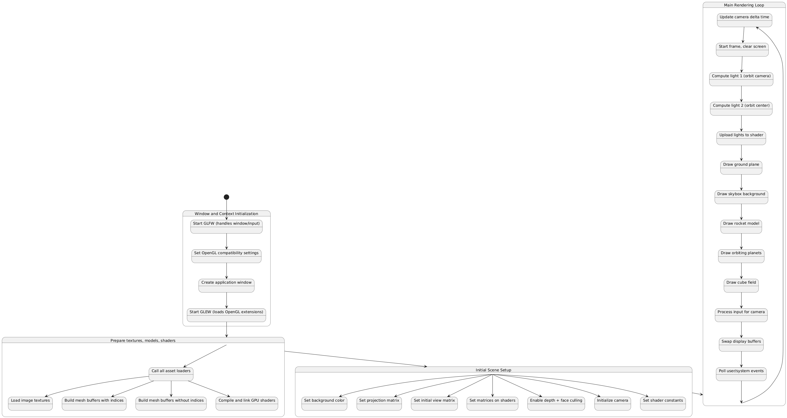
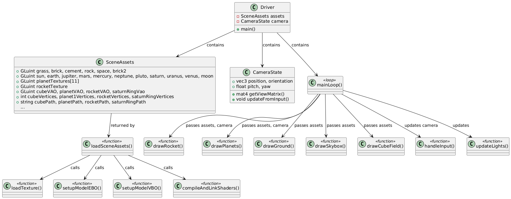

# COMP 371 – Assignment 1: Interactive 3D Solar System

## Controls

**Camera Movement**
- `W/A/S/D`: Move forward / left / backward / right
- `Space`: Move up  
- `Left Shift`: Move down  
- `Mouse`: Look around  
- `1`: Switch to First-Person Camera  
- `2`: Switch to Third-Person Camera

**Other**
- `Esc`: Exit program

## Features
- Free-look camera (mouse + keyboard)
- Camera-relative movement
- First-person and third-person camera toggle
- Multiple textured 3D models (planets, rocket, ground)
- Hierarchical animation (planets + moons)
- Dynamic lighting with two orbiting point lights
- Custom OBJ models and textures (not from tutorials)

## Project Structure
```
Project_1
├── Models
│   ├── *.obj files
│   └── *.blend files
├── OBJloader.h
├── OBJloaderV2.h
├── StateDiagram.png
├── Textures
│   └── texture images
├── UML.png
├── preview.gif
├── Export_OBJ.py
├── main
├── plantUML.txt
├── project
├── project.cpp
└── stateDiagram.txt
```





## Build Instructions

### Linux/macOS
```bash
g++ src/*.cpp -o SolarSystem -lGL -lGLEW -lglfw -ldl
./SolarSystem
```
### Windows
```bash
g++ src/*.cpp -o SolarSystem.exe -lglew32 -lglfw3 -lopengl32 -lgdi32
main.exe
```

## Dependencies
- OpenGL
- GLFW
- GLM
- GLEW (or GLAD)
- stb_image.h
- OBJloader (Tut05-compatible)

## Resources
- NASA textures: https://planetpixelemporium.com/mercury.html  
- Rocket model: https://sketchfab.com/3d-models/space-craft-f7026b90bf9b44c99c15f7afc87bcdd3  
- Additional textures: https://ambientcg.com/  
- Default sphere exported from Blender with triangulate modifier  
- COMP 371 Labs Framework by Nicolas Bergeron (2019)  
- Exported all .obj models using custom Blender script `Export_OBJ.py`
- stb_image setup:
  - Installed via: `sudo apt install libstb-dev`
  - Header located at: `include/stb/stb_image.h`
  - Compiler flag: `-I../include`

- Common linker flags:
  - lGLEW
  - lGL
  - lglfw
  - lm

## License
This project is licensed under the MIT License - see the [LICENSE](LICENSE) file for details.
